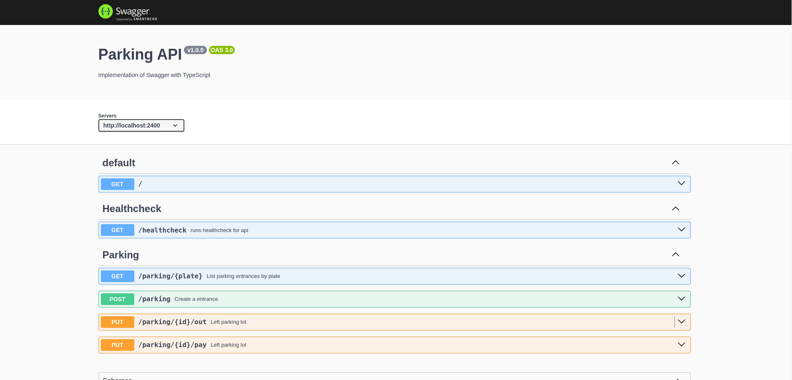

# Parking API

Welcome to the API Parking Lot project! This API allows you to manage parking lot operations such as vehicle entries, exits, payments, and retrieving parking records. It is built using Node.js, Express, and TypeScript, with MongoDB as the database.



## Summary

- [Parking API](#parking-api)
  - [Summary](#summary)
  - [Features](#features)
  - [Getting Started](#getting-started)
    - [Application Prerequisites](#application-prerequisites)
    - [Installing](#installing)
    - [Configuration](#configuration)
  - [Running the Application](#running-the-application)
    - [Development Mode](#development-mode)
    - [Production Mode](#production-mode)
    - [Using Docker and Docker Compose](#using-docker-and-docker-compose)
      - [Prerequisites](#prerequisites)
      - [Steps](#steps)
      - [Notes](#notes)
  - [API Documentation](#api-documentation)
  - [Testing](#testing)
    - [Running the tests](#running-the-tests)
    - [Scripts](#scripts)
  - [Built With](#built-with)
    - [Main Dependencies](#main-dependencies)
    - [Development Dependencies](#development-dependencies)

## Features

- **Vehicle Entry Management**: Register vehicles entering the parking lot.
- **Vehicle Exit Management**: Record when vehicles leave the parking lot.
- **Payment Processing**: Handle parking fee payments.
- **Parking Records Listing**: Retrieve parking records by vehicle license plate.
- **Health Check Endpoint**: Ensure the API is running correctly.
- **Swagger Documentation**: Interactive API documentation using Swagger UI.

## Getting Started

These instructions will get you a copy of the project up and running on
your local machine for development and testing purposes. See deployment
for notes on how to deploy the project on a live system.

### Application Prerequisites

- **Node.js**: Version 20.x or later.
- **npm**: Comes with Node.js.
- **MongoDB**: Local or remote instance.
- **TypeScript**: Installed globally (optional, but recommended).

### Installing

1. Clone the repository:

   ```bash
   git clone https://github.com/yourusername/api-parking-lot.git
   cd api-parking-lot
   ```

2. Install the dependencies:

   ```bash
   npm install
   ```

### Configuration

Create a **`.env`** file in the root directory to store environment variables. You can use the provided .env.example as a template:

```bash
  cp .env.example .env
```

Edit the **`.env`** file to include your MongoDB connection string and other configuration details:

```ini
# .env
DB_PORT=27017
PORT=2400
API_URL=http://localhost:2400
DB_CONN_STRING=mongodb://localhost:27017/parkinglot
MONGO_DATABASE=parkinglot
NODE_ENV=development
```

- **DB_PORT**: MongoDB Port number
- **PORT**: Port number the server will listen on.
- **API_URL**: API url
- **DB_CONN_STRING**: Your MongoDB connection string.
- **MONGO_DATABASE**: MongoDB Database name
- **NODE_ENV**: Environment setting (development, production, test).

## Running the Application

### Development Mode

To run the application in development mode with automatic restarts on code changes:

```bash
npm run start:dev
```

This command uses **`nodemon`** to monitor for file changes and restarts the server automatically.

### Production Mode

To build and run the application in production mode:

```bash
npm run build
npm start
```

- `npm run build`: Compiles TypeScript files into JavaScript in the dist directory.
- `npm start`: Runs the compiled application using ts-node.

### Using Docker and Docker Compose

You can run the application using Docker and Docker Compose, which simplifies deployment by containerizing the application and its dependencies.

#### Prerequisites

- **Docker**: Install from Docker's official website.
- **Docker Compose**: Usually included with Docker Desktop.

In the root directory, build and start the containers:

```bash
docker-compose up --build
```

#### Steps

1. **Update the `.env`` File**

Ensure that the variables in `.env` file points to the MongoDB service defined in your Docker Compose file:

```bash
DB_PORT=27017
PORT=2400
API_URL=http://localhost:2400
DB_CONN_STRING=mongodb://localhost:27017/parkinglot?authSource=admin&retryWrites=false
MONGO_DATABASE=parkinglot
NODE_ENV=development
```

2. **Run Docker Compose**
   In the root directory, build and start the containers:

```bash
docker-compose up --build
```

**Flags**:

- `--build``: Builds the images before starting containers.

3. **Access the Application**
   The API should now be running inside a Docker container and accessible at:

```bash
http://localhost:2400
```

The Swagger documentation is available at:

```bash
http://localhost:2400/docs
```

#### Notes

- **Volumes**:
  - The volume ./mongodb/database:/data/db ensures that MongoDB data persists between container restarts. - The volume .:/app allows for live reloading of code changes without rebuilding the image.
- **Ports**:
  - The application listens on port 2400 inside the container.
  - The host port is set by the PORT environment variable or defaults to 2400.
- **Environment Variables**:
  - Adjust the environment variables in the `docker-compose.yml` and `.env`` files as needed.
- **Network Configuration**:
  - The `parking-lot-net`` network facilitates communication between the api and mongodb services.

## API Documentation

Swagger UI is integrated for interactive API documentation. Once the server is running (either directly or via Docker), access the documentation at:

```bash
http://localhost:2400/docs
```

This interface provides detailed information about the API endpoints, request and response schemas, and allows you to test the API directly from your browser.

## Testing

The project includes unit and integration tests using Jest and Supertest.

### Running the tests

To execute all tests and generate a coverage report:

```bash
npm test
```

### Scripts

The following scripts are available in the package.json:

- `npm start`: Runs the application using ts-node.
- `npm run start:dev`: Runs the application in development mode with nodemon.
- `npm run build`: Compiles TypeScript files to JavaScript.
- `npm test`: Runs tests with coverage using Jest.
- `npm run swagger`: Generates Swagger documentation.
- `npm run lint`: Lints the codebase using ESLint.
- `npm run format`: Formats the codebase using Prettier.

## Built With

### Main Dependencies

- [Express](https://www.npmjs.com/package/express): Web framework for Node.js.
- [TypeScript](https://www.npmjs.com/package/typescript): Strongly typed programming language that builds on JavaScript.
- [Mongoose](https://www.npmjs.com/package/mongoose): MongoDB object modeling tool.
- [dotenv](https://www.npmjs.com/package/dotenv): Loads environment variables from a .env file.
- [Swagger UI Express](https://www.npmjs.com/package/swagger-ui-express): Serves Swagger UI for API documentation.
- [Swagger Autogen](https://www.npmjs.com/package/swagger-autogen): Automatically generates Swagger documentation.
- [@automapper/core, @automapper/classes, @automapper/pojos:](https://www.npmjs.com/package/@automapper/core) Libraries for object mapping.

### Development Dependencies

- [TypeScript ESLint](https://www.npmjs.com/package/@typescript-eslint/eslint-plugin) and [ESLint](https://www.npmjs.com/package/eslint): Linting and code quality tools.
- [Jest](https://www.npmjs.com/package/jest) and [ts-jest](https://www.npmjs.com/package/ts-jest): Testing framework for unit and integration tests with TypeScript support.
- [Supertest](https://www.npmjs.com/package/supertest): HTTP assertions for testing API endpoints.
- [Nodemon](https://www.npmjs.com/package/nodemon): Monitors for changes and restarts the server in development.
- [MongoDB Memory Server](https://www.npmjs.com/package/mongodb-memory-server): In-memory MongoDB for testing purposes.
- [ts-node](https://www.npmjs.com/package/ts-node): Executes TypeScript code directly without precompiling.
- [Prettier](https://www.npmjs.com/package/prettier): Code formatter.
